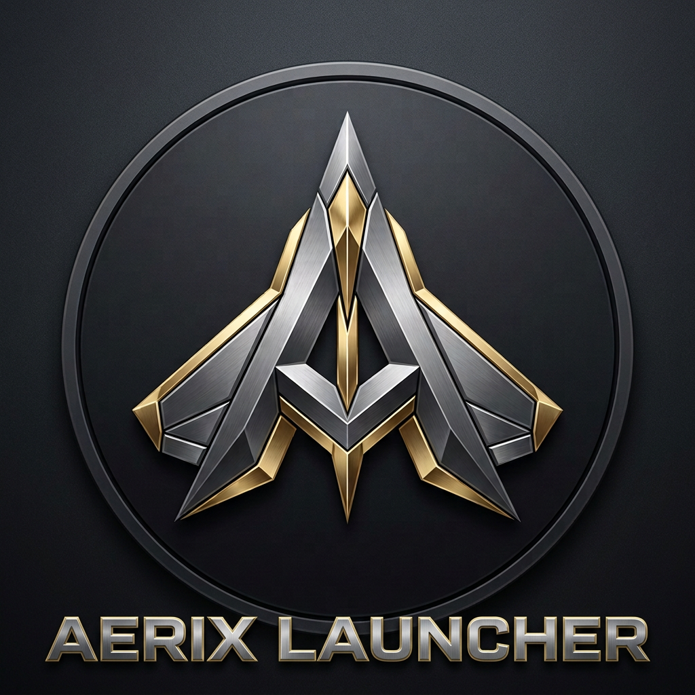
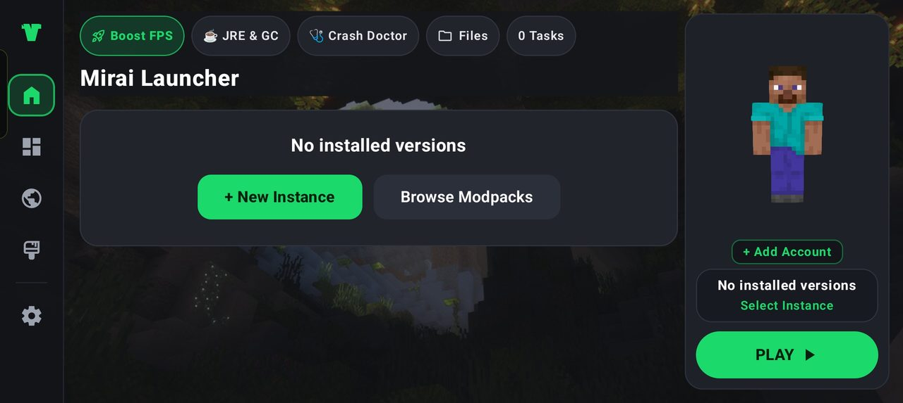
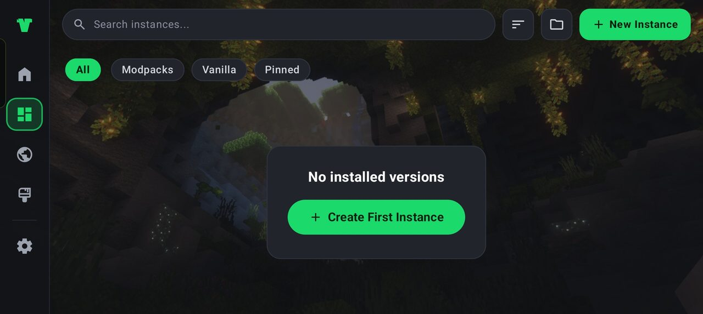
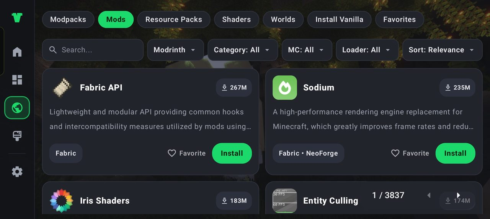
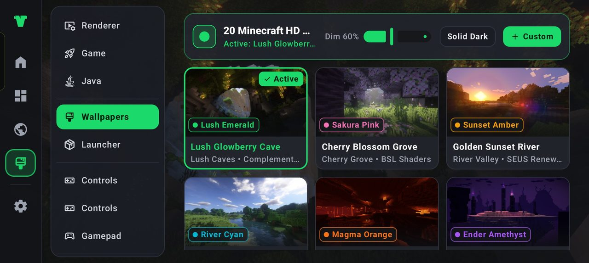
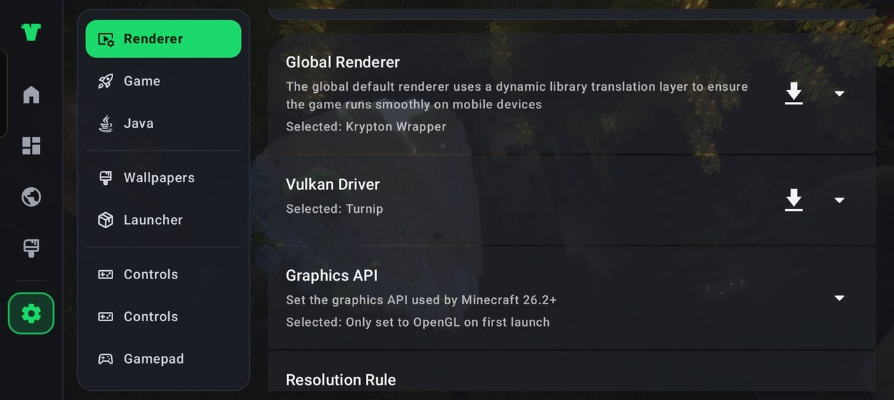

# ✨ 🚀 MIRAI LAUNCHER
### The Best Minecraft: Java Edition Launcher for Android

**Hand-built. Privately kept. Tested on real phones. Maintained by one developer.**

▶ Play &nbsp;·&nbsp; 🔍 Discover &nbsp;·&nbsp; ⚙️ Settings &nbsp;·&nbsp; 👤 Offline accounts & capes &nbsp;·&nbsp; 🔒 Private by design

---

## 📸 Screenshots

**Home dashboard** — quick actions (Boost FPS, JRE & GC, Crash Doctor), account status and PLAY at a glance.

**Instances** — search, filter (All / Modpacks / Vanilla / Pinned) and create new instances.

**Discover** — browse and install mods, modpacks, shaders and more.

**Wallpapers** — 20 built-in HD Minecraft wallpapers with dim control and custom imports.

**Renderer settings** — renderer, Vulkan driver and graphics API per version.

---

## 🏆 Why Mirai

Mirai Launcher is a **Minecraft: Java Edition** launcher for Android, built to feel faster, cleaner, and more complete than the launchers most players settle for.

It is not a generated app. It is not a team product with a tracker bolted on. It is a **well-developed, frequently updated** launcher, written and tested by **a single developer — entitybrian** — on more than one phone, so the thing that ships is the thing that actually runs in a hand.

> ✨ One developer. Zero AI. Real devices. Private by default.

---

## ⚡ Built for excellent performance

Mirai is tuned for the phone, not for a demo video.

- ⚡ **Fast path to play** — recent worlds and instances stay one tap away.
- 🧩 **Serious render stack** — choose the renderer that fits the device. LTW and LTW Legacy are built from source in this repository and cover Minecraft 1.17+ and 1.8–1.16.5 respectively, alongside GL4ES, VirGL, Zink-class, and Mesa options. Mirai also bundles **MobileGlues** for Minecraft 1.17+, two **VGPU** options for 1.16.5 and older, and selects the right renderer for each version automatically.
- 🧮 **RAM that you control** — a global memory slider, plus per-instance overrides when a pack needs more.
- 📱 **Tested on other phones** — layouts, accounts, skins, and launch flow are checked across devices, not only on the developer’s main handset. That real-world pass is what keeps Mirai ahead of launchers that only look good on one screen.
- 🛠️ **Updated often** — fixes and polish land on a regular cadence, with a built-in update check against GitHub Releases.

---

## 🛡️ Private. On purpose.

Mirai keeps your launcher private.

- 🚫 **No ads**
- 🚫 **No telemetry**
- 🚫 **No account resale, no profile harvesting**
- 🔒 Accounts, skins, and capes stay on the device unless you choose a login that needs the network
- 📦 Open source under **GPL-3.0**, so the behavior is inspectable

Your worlds are yours. Your accounts are yours. Mirai does not take a cut of either.

---

## 👤 Accounts, skins, and capes

- 👤 **Offline accounts** — create a local username and select it. The radio stays selected. Worldwide. No region lock.
- 👕 **Equip a skin** on that offline account.
- 🧥 **Equip a cape** on that offline account.
- 🌐 **Microsoft login** for Java Edition accounts that own the game.
- 🔑 **Yggdrasil / auth-server login** for third-party servers.
- 🖼️ **3D skin preview** so you can see the skin and cape before you launch.

---

## 📋 Full feature list

### ▶ Play
- Unified Play hub for recent worlds and your library
- Launch, edit, duplicate, delete, and manage instances
- Instance icons — color, symbol, or emoji
- Instance groups, so modpacks and survival worlds stay sorted
- Version install and version settings
- Per-instance and global game options

### 🔍 Discover
- Browse and install **modpacks, mods, resource packs, shaders, and saves**
- Search, filters, and favorites
- Downloads that land in the right instance, not in a random folder

### ⚙️ Settings
- Material 3 interface, dark and light
- Theme and accent control
- Renderer selection
- Global and per-instance RAM
- Background and launcher appearance
- Language support
- About page — owner: **entitybrian**
- Update checker via the GitHub Releases API

### 🎮 In game and around it
- Touch control editor, including custom layouts
- Gamepad support and remapping
- File manager inside the launcher — configs, mods, worlds, backups
- Multiplayer screen
- Log viewer when something goes wrong
- Modpack import
- License and credits screens kept reachable — nothing useful is stripped out to look “simpler”

### 🛡️ Quality bar
- **100% human-made. Non-AI.** Every screen is developed, not generated.
- **Single-developer maintenance** by entitybrian — one person owns the bugs and the fixes.
- **Real-phone testing** on more than one device before a build is treated as good.
- **Frequent updates**, with Debug CI on push and pull request so broken builds do not silently ship.

---

## 🥇 Mirai vs typical Android launchers

| | Mirai Launcher | Typical launcher |
| --- | --- | --- |
| Best-in-class Java launcher for Android | ✅ Built for it | ⚠️ Often a port |
| Offline account + skin + cape | ✅ | ⚠️ Cape often missing |
| Microsoft + auth servers | ✅ | ⚠️ Hit or miss |
| Modrinth-style Play / Discover / Settings | ✅ | ❌ Dated menus |
| No ads, no telemetry | ✅ Private | ⚠️ Often tracked |
| Human-made, non-AI | ✅ | ❌ Increasingly generated |
| Tested on other phones | ✅ | ⚠️ One-device demos |
| Updated often by the maintainer | ✅ Solo, active | ⚠️ Stalls |
| Open source | ✅ GPL-3.0 | ⚠️ Sometimes closed |

Mirai does not need a bigger team to be the better launcher. It needs care, and it has it.

---

## 👨‍💻 Maintained by a single developer

**entitybrian** designs, writes, tests, and ships Mirai Launcher alone.

No studio. No outsourced UI. No AI pass that “fills in the screens.”

That is why the product stays coherent: the same person who adds offline capes is the person who checks them on another phone, and the same person who cuts a release when it is actually ready.

---

## 📥 Install

1. Download the latest APK from [Releases](https://github.com/entitybrian69-bit/Mirai-launcher/releases).
2. Allow install from this source in Android settings.
3. Open Mirai, add an offline account or sign in with Microsoft, equip a skin and cape, and play.

**Requires Android 8.0+.** Best on 4 GB RAM or more.

Debug builds from CI are for testing. Release builds are the ones to keep.

---

## 🔄 Updates

Settings → About → Check for update.

Mirai asks the GitHub Releases API, compares your build, and points you at the newest APK. No mystery JSON. No dead link.

---

## 🤝 Contributing

This is a solo project. Help is still welcome.

- ⭐ Star the repo
- 🐛 Open a clear bug report
- 💡 Suggest a feature
- 🌍 Help translate

---

## 💬 Community and suggestions

**Discord channel** — join to talk with other Mirai users, report a problem, and suggest what
should land next.

**Invite link:** <https://discord.gg/6EFrhqmd>

---

## 📜 License

GPL-3.0. See [LICENSE](LICENSE).

Minecraft is a trademark of Mojang Synergies AB. Mirai Launcher is an independent project and is not affiliated with, endorsed by, or associated with Mojang or Microsoft.

---

### 🎮 The best Java launcher on Android for Minecraft.

**Excellent performance. Well developed. Non-AI. Updated often. Private. Offline accounts and capes. Tested on other phones. Maintained by one developer.**

⭐ [Star Mirai](https://github.com/entitybrian69-bit/Mirai-launcher) · 📦 [Get the APK](https://github.com/entitybrian69-bit/Mirai-launcher/releases)

